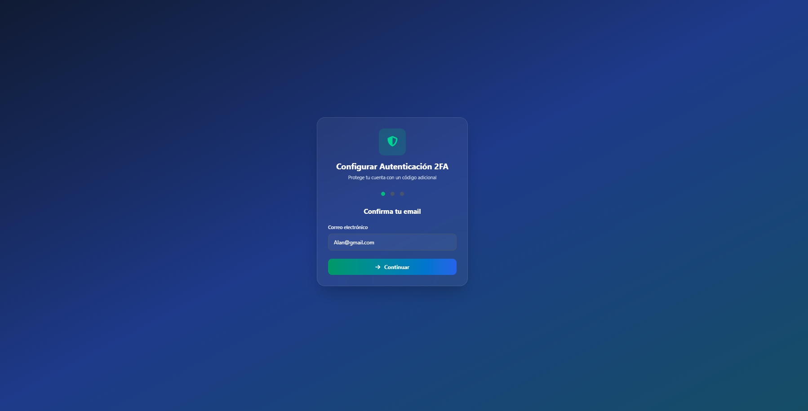
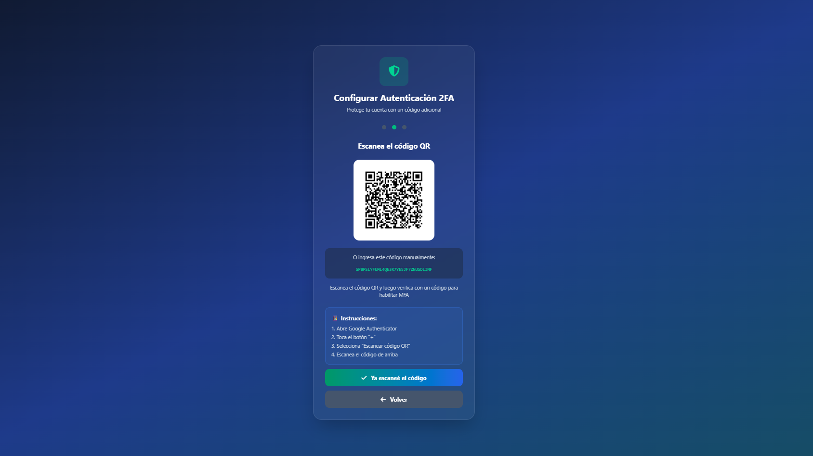
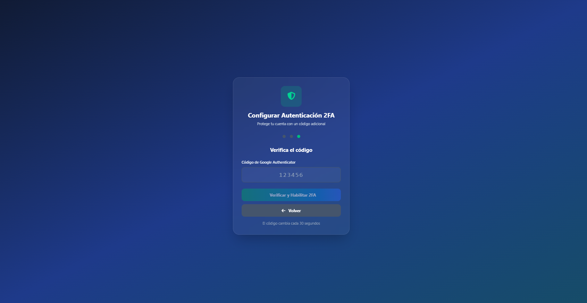
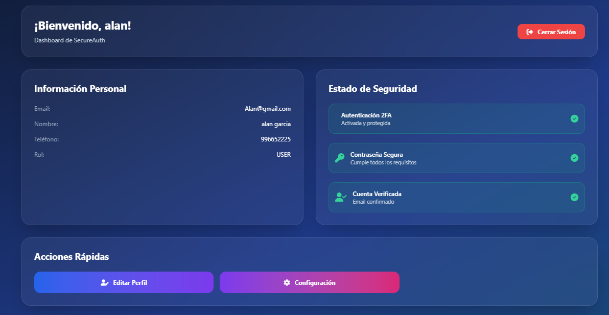

# 🔐 SecureAuth - JWT Authentication Frontend

Una aplicación Angular moderna de autenticación con JWT, Spring Security y autenticación de dos factores (2FA) usando Google Authenticator.


<div align="center">
  <a href="./registro.png" target="_blank">
    
  </a>
  <a href="./imagen_2025-07-21_011417843.png" target="_blank">
    
  </a>
  <a href="./imagen_2025-07-21_011447668.png" target="_blank">
    
  </a>
  <a href="./imagen_2025-07-21_011506697.png" target="_blank">
    
  </a>
  <a href="./imagen_2025-07-21_011523150.png" target="_blank">
    
  </a>
  <a href="./imagen_2025-07-21_011603189.png" target="_blank">
    
  </a>
  <a href="./imagen_2025-07-21_011627379.png" target="_blank">
    
  </a>
</div>


## 📋 Tabla de Contenidos

- [Características](#-características)
- [Arquitectura](#-arquitectura)
- [Tecnologías](#-tecnologías)
- [Instalación](#-instalación)
- [Configuración](#-configuración)
- [Uso](#-uso)
- [API Endpoints](#-api-endpoints)
- [Estructura del Proyecto](#-estructura-del-proyecto)
- [Contribución](#-contribución)
- [Licencia](#-licencia)

## ✨ Características

### 🔒 Seguridad Avanzada
- **JWT Token Authentication** - Autenticación segura basada en tokens
- **Autenticación de Dos Factores (2FA)** - Integración con Google Authenticator
- **Interceptor HTTP** - Manejo automático de tokens y errores 401
- **Guards de Ruta** - Protección de rutas autenticadas
- **Validación de Contraseñas** - Sistema de validación de seguridad en tiempo real

### 🎨 Interfaz de Usuario
- **Diseño Responsive** - Compatible con todos los dispositivos
- **Animaciones Fluidas** - Transiciones suaves con Angular Animations
- **Notificaciones Toast** - Sistema de retroalimentación visual
- **UI/UX Moderna** - Diseño glassmorphism con Tailwind CSS

### 🚀 Funcionalidades
- Registro de usuarios con validación completa
- Inicio de sesión con soporte 2FA
- Dashboard protegido con información del usuario
- Configuración de MFA con códigos QR
- Gestión de sesiones con "Recordarme"
- Integración preparada para login social (Google, GitHub)

## 🏗️ Arquitectura

El proyecto sigue una arquitectura limpia y escalable:

```
src/app/
├── core/                     # Servicios centrales y lógica de negocio
│   ├── guards/              # Guards de autenticación
│   ├── interceptors/        # Interceptores HTTP
│   ├── models/              # Interfaces y modelos de datos
│   └── services/            # Servicios de autenticación y temas
├── pages/                   # Páginas principales
│   ├── dashboard/           # Dashboard de usuario
│   └── registro/            # Registro y login
├── shared/                  # Componentes y utilidades compartidas
│   ├── components/          # Componentes reutilizables
│   └── environments/        # Configuración de entornos
└── app.component.ts         # Componente raíz
```

### 🔄 Flujo de Autenticación

1. **Registro/Login** → Validación de formularios
2. **Verificación 2FA** → Código Google Authenticator (si está habilitado)
3. **Token JWT** → Almacenamiento seguro en localStorage
4. **Interceptor** → Inyección automática de token en requests
5. **Guards** → Protección de rutas autenticadas
6. **Dashboard** → Acceso a funcionalidades protegidas

## 🛠️ Tecnologías

### Frontend
- **Angular 19.2.1** - Framework principal
- **TypeScript** - Lenguaje de programación
- **RxJS** - Programación reactiva
- **Angular Reactive Forms** - Manejo de formularios
- **Angular Animations** - Animaciones y transiciones

### Styling & UI
- **Tailwind CSS** - Framework de CSS utilitario
- **Flowbite** - Componentes UI
- **Font Awesome** - Iconografía
- **CSS Glassmorphism** - Efectos visuales modernos

### Build & Development
- **Angular CLI** - Herramientas de desarrollo
- **TypeScript Compiler** - Compilación
- **Webpack** - Bundling (integrado en Angular CLI)

## 🚀 Instalación

### Prerrequisitos
- Node.js (versión 18 o superior)
- npm o yarn
- Angular CLI 19+

### Pasos de Instalación

1. **Clonar el repositorio**
```bash
git clone https://github.com/App-Authenticator/App-JWT-Auth-FrontEnd.git
cd App-JWT-Auth-FrontEnd
```

2. **Instalar dependencias**
```bash
npm install
# o
yarn install
```

3. **Configurar variables de entorno**
```bash
# Editar src/app/shared/environments/config.ts
# Cambiar la URL del backend según tu configuración
```

4. **Ejecutar la aplicación**
```bash
ng serve
```

5. **Abrir en el navegador**
```
http://localhost:4200
```

## ⚙️ Configuración

### Variables de Entorno

Edita el archivo `src/app/shared/environments/config.ts`:

```typescript
// Configuración del backend
let baserUrl = 'http://localhost:8080'  // URL de tu API Spring Boot
export default baserUrl;
```

### Configuración del Backend

Asegúrate de que tu backend Spring Boot esté configurado con:
- Endpoints de autenticación (`/api/auth/login`, `/api/auth/register`)
- Soporte para JWT tokens
- Integración con Google Authenticator para 2FA
- CORS habilitado para el frontend

## 📱 Uso

### 1. Registro de Usuario
- Completa todos los campos requeridos
- La contraseña debe cumplir los requisitos de seguridad
- Acepta los términos y condiciones
- El sistema validará el email automáticamente

### 2. Configuración 2FA (Opcional)
- Escanea el código QR con Google Authenticator
- Verifica el código de 6 dígitos
- El 2FA quedará habilitado para futuras sesiones

### 3. Inicio de Sesión
- Ingresa email y contraseña
- Si tienes 2FA habilitado, ingresa el código actual
- Marca "Recordarme" para sesiones persistentes

### 4. Dashboard
- Visualiza tu información personal
- Gestiona la configuración de seguridad
- Accede a funcionalidades protegidas

## 🔌 API Endpoints

El frontend consume los siguientes endpoints del backend:

| Método | Endpoint | Descripción |
|--------|----------|-------------|
| `POST` | `/api/auth/register` | Registro de nuevo usuario |
| `POST` | `/api/auth/login` | Inicio de sesión |
| `POST` | `/api/auth/setup-mfa` | Configuración inicial de 2FA |
| `POST` | `/api/auth/verify-mfa` | Verificación de código 2FA |

### Ejemplo de Request - Registro
```json
{
  "email": "usuario@ejemplo.com",
  "nombre": "Juan",
  "apellido": "Pérez",
  "telefono": "+51999123456",
  "password": "MiPassword123!",
  "dni": "12345678"
}
```

### Ejemplo de Response - Login Exitoso
```json
{
  "token": "eyJhbGciOiJIUzI1NiIsInR5cCI6IkpXVCJ9...",
  "user": {
    "id": 1,
    "email": "usuario@ejemplo.com",
    "nombre": "Juan",
    "apellido": "Pérez",
    "role": "USER",
    "mfa_enabled": true
  },
  "type": "Bearer",
  "expiresIn": 86400
}
```

## 📁 Estructura del Proyecto

```
src/
├── app/
│   ├── core/
│   │   ├── guards/
│   │   │   └── auth.guard.ts              # Guard de autenticación
│   │   ├── interceptors/
│   │   │   └── auth.interceptor.ts        # Interceptor JWT
│   │   ├── models/
│   │   │   ├── auth.model.ts              # Modelos de autenticación
│   │   │   └── user.model.ts              # Modelo de usuario
│   │   └── services/
│   │       ├── AuthService.ts             # Servicio de autenticación
│   │       └── ThemeService.ts            # Servicio de temas
│   ├── pages/
│   │   ├── dashboard/
│   │   │   ├── dashboard.component.html
│   │   │   └── dashboard.component.ts
│   │   └── registro/
│   │       ├── registro.component.html    # Formularios de registro/login
│   │       └── registro.component.ts
│   ├── shared/
│   │   ├── components/
│   │   │   └── mfa-setup/                 # Componente configuración 2FA
│   │   └── environments/
│   │       └── config.ts                  # Configuración de endpoints
│   ├── app.component.ts                   # Componente raíz
│   ├── app.config.ts                      # Configuración de la app
│   └── app.routes.ts                      # Definición de rutas
├── flowbite.service.ts                    # Servicio Flowbite
├── index.html                             # HTML principal
├── main.ts                                # Punto de entrada
└── styles.css                             # Estilos globales
```

## 🔧 Scripts Disponibles

```bash
# Desarrollo
ng serve                    # Servidor de desarrollo
ng serve --open            # Abrir automáticamente en el navegador

# Build
ng build                    # Build de producción
ng build --watch           # Build con observación de cambios

# Testing
ng test                     # Ejecutar tests unitarios
ng e2e                      # Tests end-to-end

# Linting y Formato
ng lint                     # Linter de código
```

## 🤝 Contribución

1. Fork el proyecto
2. Crea una rama para tu feature (`git checkout -b feature/AmazingFeature`)
3. Commit tus cambios (`git commit -m 'Add some AmazingFeature'`)
4. Push a la rama (`git push origin feature/AmazingFeature`)
5. Abre un Pull Request

### Estándares de Código
- Seguir las convenciones de Angular Style Guide
- Usar TypeScript estricto
- Mantener cobertura de tests > 80%
- Documentar funciones públicas
- Usar commits semánticos

## 📄 Licencia

Este proyecto está bajo la Licencia MIT. Ver el archivo `LICENSE` para más detalles.

## 🙏 Reconocimientos

- [Angular](https://angular.io/) - Framework web
- [Tailwind CSS](https://tailwindcss.com/) - Framework CSS
- [Flowbite](https://flowbite.com/) - Componentes UI
- [Font Awesome](https://fontawesome.com/) - Iconos
- [Google Authenticator](https://support.google.com/accounts/answer/1066447) - 2FA

---

**Desarrollado con ❤️ y ☕ by Jcv Code**
